<!--
  md_document:
    variant: markdown_github
-->

## Abstract

The hospitality industry is an important composition of America’s GPA,
generating more than 500 billion dollars each year. In this forecasting
assignment, we are interested in forcasting the number of employees in
the hospitality industry. This is important because low number of
employees implies high unemployment rate, which is not a good sign for
overall economy.

In this forecasting assignment, we selected a
SARIMA (5,1,2) × (0,1,1)<sub>12</sub> model to forecast the number of
employees in the Hospitality Industry. By comparing the forecasting
values with the actual values, we found that the model overestimated the
number of employees, with increasing gaps as time progreeses. We arrived
at a conclusion that this model may be improved by using only data after
2010.

## Introduction

### The Hospitality Industry

The **hospitality industry** is a broad category of fields within the
service industry that includes lodging, food and drink service, event
planning, theme parks, travel and tourism. It includes hotels, tourism
agencies, restaurants and bars. As of 2020,, the United States
Department of Labor Standard Industrial Classification (SIC) defines the
hospitality industry more broadly, including

-   Hotels and Motels
-   Eating and Drinking Places
-   Arrangement of Passenger Transportation like travel agencies

The entire industry worth more than 500 billion dollars. Thus it is
important to make a meaningful forcast to its components and learn
insights about it. Therefore, I would dedicate this project to forcast
**the total number of employees across time**.

### The Dataset.

I obtained this dataset from
[Kaggle](https://www.kaggle.com/datasets/gabrielsantello/hospitality-employees-time-series-dataset/code).
This is a simple dataset consisting of just two columns, the first
column is `Date`, which takes record monthly from January 1st, 1990 to
December 1st, 2018. The second column is the `# Employees`, which is the
Average of employees each month (in thousands). There are a total of 348
valid rows.

### Techniques

In the entire process of forcasting, I used techniques taught in my
PSTAT 174/274 class including

-   Visualization techniques
-   transformation
-   differencing
-   Model identification
-   acf/pacf discussion
-   Model estimation
-   Check of stationarity/invertibility
-   Diagnostic Checking
-   Forecasting

### Software

This project was worked with R version 4.2.0 (2022-02-22)

### Results and Conclusions

Wwe selected a SARIMA (5,1,2) × (0,1,1)<sub>12</sub> model to forecast
the number of employees in the Hospitality Industry. By comparing the
forecasting values with the actual values, we found that the model
overestimated the number of employees, with increasing gaps as time
progreeses.

## The Forcasting

### Plot and analyze the time series.

We will first set the working directory and load the dataset

``` r
setwd("/Users/teo/Desktop/pstat-174-final-project")
set.seed(1205)
```

``` r
hos <- read.csv("data/HospitalityEmployees.csv")
employees <- hos$Employees
nt <- length(employees)
tsdat <- ts(employees, start = c(1990,1), end = c(2018,12), frequency = 12)
ts.plot(tsdat, main = "Raw Data")
abline(h=mean(employees), col="blue")
```

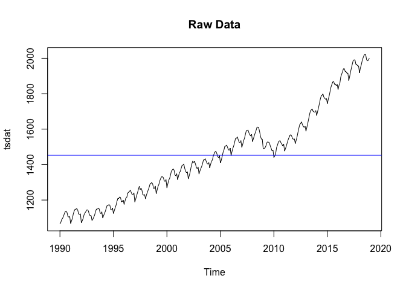

Some immediate obseravtion of this dataset is that:

-   there is a linearity in the dataset
-   there is also an obvious seasonality
-   We have relatively constant variance (ignoring the abnormality
    in 2008) and a non-constant mean

more specifically, we witness **a drop of employees in 2008-2009**,
which is probably due to the global economic crisis that took place in
2008.

Now we partition the data into a training and testing set. And we leave
24 data points for verification.

``` r
employees.training <- employees[c(1:323)]
employees.test <- employees[c(324:348)]
plot.ts(employees.training)
fit <- lm(employees.training ~ as.numeric(1:length(employees.training)))
abline(fit, col="red")
abline(h=mean(employees), col="blue")
```

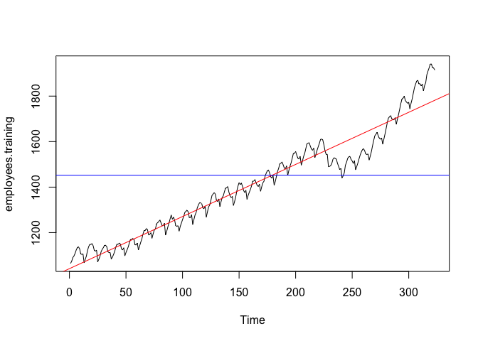

#### Histogram

And we will also plot out the histogram to verify the variance

``` r
hist(employees.training, col="light blue", xlab="", main="histogram; employee data")
```


And indeed, we see that the histogram skewed a little. And we can treat
it as constant variance. So we dont need a transformation.

#### Histogram of Raw Data

We also plot out the ACF to check seasonality and trend

``` r
acf(employees.training,lag.max=40, main="ACF of the Airpass Data")
```

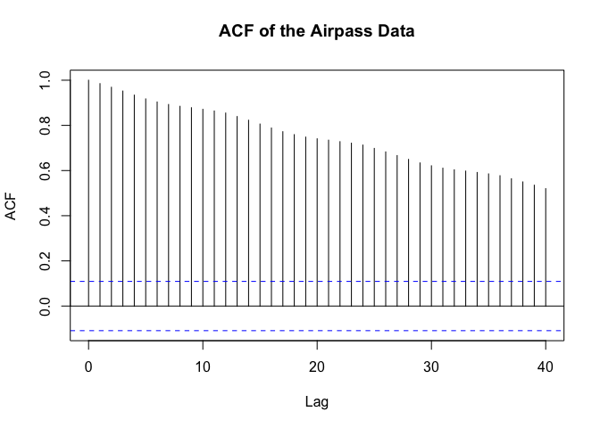

And indeed, ACFs remain large and periodic (a little), so we might
consider differencing.

### Transformation and Differencing

#### Transformation

As stated in the previous section, no transformation required for this
dataset

#### Differencing

We will first make a decomposition of the time series

``` r
library(ggplot2)
library(ggfortify)
y <- ts(employees.training, frequency = 12)
decomp <- decompose(y)
plot(decomp)
```


we see that a decomposition of the time series shows seasonality and a
linear trend, despite a small drop at 2008-2009. Therefore, we will
difference the data.

``` r
var(employees.training)[1]
```

    ## [1] 48721.73

Our time series has variance of 40626.52, now differencing at lag 12

``` r
employees_lag12 <- diff(employees.training,lag = 12)
plot.ts(employees_lag12, main="U_t differenced at lag 12")
fit <- lm(employees_lag12 ~ as.numeric(1:length(employees_lag12)))
abline(fit, col="red")
abline(h=mean(employees_lag12), col="blue")
```

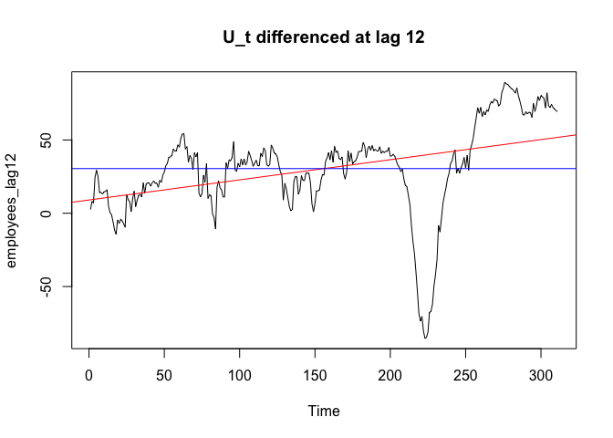

``` r
var(employees_lag12)
```

    ## [1] 1024.479

And now the variance is 979, which is significantly lower. But we still
have large variance and a non-zero mean. The ACF of the differenced
series at lag 12 looks like

``` r
acf(employees_lag12, lag.max=40, main="ACF of the U_t, differenced at lag 12")
```

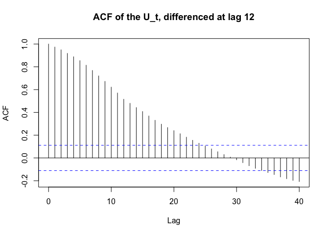

We see that seasonality no longer apparent, and the ACFs are decaying
slowly, meaning that the series is still non stationary.

We continue differencing at lag 1,

``` r
employees_stat <- diff(employees_lag12,lag = 1)
plot.ts(employees_stat, main="U_t differenced at lag 12 & lag 1")
fit <- lm(employees_stat ~ as.numeric(1:length(employees_stat)))
abline(fit, col="red")
abline(h=mean(employees_stat), col="blue")
```


``` r
var(employees_stat)
```

    ## [1] 46.56826

We see that now the variance is only 47.71, and the plot looks
stationary, with constant mean and variance and looks like white noise.
So we achieved our purpose. We further verify this observation by
historgram.

``` r
hist(employees_stat, density=20,breaks=20, col="blue", xlab="", prob=TRUE)
m<-mean(employees_stat)
std<- sqrt(var(employees_stat))
curve( dnorm(x,m,std), add=TRUE )
```

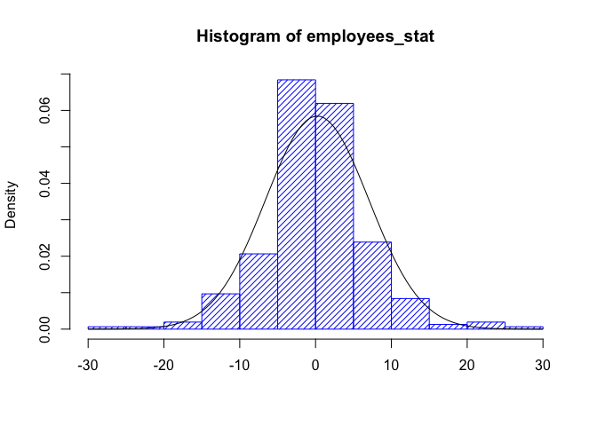

The histogram looks much more normal. We will show the ACF and PACF on
the next section.

#### Plot and analyze ACF and PACF to preliminary identify your models

``` r
acf(employees_stat, lag.max=40, main="ACF of the U_t, differenced at lags 12 and 1")
```

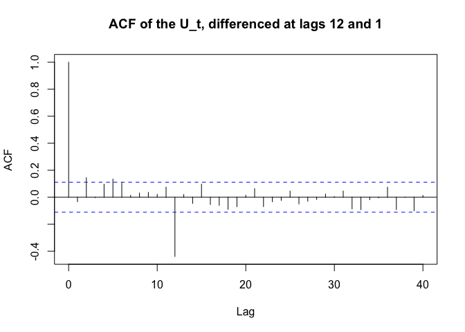

The ACFs outside of of the confidence interval are at **lag 2, 5, 12**

``` r
pacf(employees_stat, lag.max=40, main="PACF of the U_t, differenced at lags 12 and 1")
```

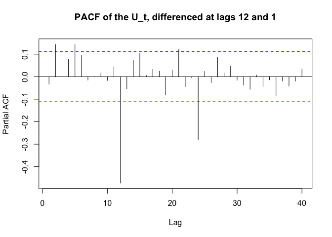

The PACFs outside of of the confidence interval are at **lag 2, 5, 12,
22, 24**. We can choose model parameters as follows. Notice that there
seem to be an exponential decay at lag 12, 24, 36, so we choose *Q* = 0

*p* = 0, 2, 5  *d* = 1  *q* = 0, 2, 5  *P* = 1  *D* = 1  *Q* = 0  *s* = 12

#### Model Fitting

Our strategy of finding two best models is to run a loop for all
parameters and sort out the two models with Lowest AICc value.

``` r
library(qpcR)
```

    ## Loading required package: MASS

    ## Loading required package: minpack.lm

    ## Loading required package: rgl

    ## Loading required package: robustbase

    ## Loading required package: Matrix

``` r
print("p d q P D Q")
```

    ## [1] "p d q P D Q"

``` r
for (p in c(0,2,5)){
    for (d in c(1)){
        for (q in c(0,2,5)){
            for (P in c(0,1)){
                for (D in c(1)){
                    for (Q in c(0,1)){
                        print(c(p,d,q,P,D,Q))
                        print(AICc(arima(employees.training,order = c(p,d,q),seasonal = list(order = c(P,D,Q), period = 12), method="ML"))) 
                    }
                }
            }
        }
    }
}
```

    ## [1] 0 1 0 0 1 0
    ## [1] 2071.736
    ## [1] 0 1 0 0 1 1
    ## [1] 1964.109
    ## [1] 0 1 0 1 1 0
    ## [1] 2005.71
    ## [1] 0 1 0 1 1 1
    ## [1] 1965.466
    ## [1] 0 1 2 0 1 0
    ## [1] 2069.902
    ## [1] 0 1 2 0 1 1
    ## [1] 1957.807
    ## [1] 0 1 2 1 1 0
    ## [1] 1998.389
    ## [1] 0 1 2 1 1 1
    ## [1] 1959.746
    ## [1] 0 1 5 0 1 0
    ## [1] 2068.476
    ## [1] 0 1 5 0 1 1
    ## [1] 1951.655
    ## [1] 0 1 5 1 1 0
    ## [1] 1994.53
    ## [1] 0 1 5 1 1 1
    ## [1] 1953.647
    ## [1] 2 1 0 0 1 0
    ## [1] 2068.952
    ## [1] 2 1 0 0 1 1
    ## [1] 1955.055
    ## [1] 2 1 0 1 1 0
    ## [1] 1996.201
    ## [1] 2 1 0 1 1 1
    ## [1] 1957.103
    ## [1] 2 1 2 0 1 0
    ## [1] 2069.071
    ## [1] 2 1 2 0 1 1
    ## [1] 1935.809
    ## [1] 2 1 2 1 1 0

    ## Warning in log(s2): NaNs produced

    ## [1] 1987.449
    ## [1] 2 1 2 1 1 1
    ## [1] 1937.051
    ## [1] 2 1 5 0 1 0
    ## [1] 2051.824
    ## [1] 2 1 5 0 1 1
    ## [1] 1940.756
    ## [1] 2 1 5 1 1 0
    ## [1] 1986.338
    ## [1] 2 1 5 1 1 1
    ## [1] 1942.19
    ## [1] 5 1 0 0 1 0
    ## [1] 2066.573
    ## [1] 5 1 0 0 1 1
    ## [1] 1943.759
    ## [1] 5 1 0 1 1 0
    ## [1] 1988.936
    ## [1] 5 1 0 1 1 1
    ## [1] 1945.227
    ## [1] 5 1 2 0 1 0
    ## [1] 2068.298
    ## [1] 5 1 2 0 1 1
    ## [1] 1941.005
    ## [1] 5 1 2 1 1 0
    ## [1] 1988.373
    ## [1] 5 1 2 1 1 1
    ## [1] 1942.421
    ## [1] 5 1 5 0 1 0
    ## [1] 2035.202
    ## [1] 5 1 5 0 1 1

    ## Warning in log(s2): NaNs produced

    ## [1] 1942.859
    ## [1] 5 1 5 1 1 0
    ## [1] 1981.359
    ## [1] 5 1 5 1 1 1
    ## [1] 1946.23

Below are three models with the least AICc values, we can see that there
AICc values are very close, and parameters are also similar.

$$
\\operatorname{SARIMA}(5,1,2)\\times(0,1,1)\_{12}\\\\
\\operatorname{SARIMA}(2,1,2)\\times(0,1,1)\_{12}\\\\
$$

##### Model 1 SARIMA (5,1,2) × (1,1,0)<sub>12</sub>

``` r
model1 <- arima(employees.training,order = c(5,1,2),seasonal = list(order = c(0,1,1), period = 12), method="ML")
model1
```

    ## 
    ## Call:
    ## arima(x = employees.training, order = c(5, 1, 2), seasonal = list(order = c(0, 
    ##     1, 1), period = 12), method = "ML")
    ## 
    ## Coefficients:
    ##          ar1      ar2      ar3     ar4     ar5      ma1     ma2     sma1
    ##       0.8938  -0.0710  -0.0136  0.0108  0.0732  -0.9494  0.2416  -0.7474
    ## s.e.  0.7132   0.4798   0.1344  0.0810  0.0841   0.7145  0.5126   0.0438
    ## 
    ## sigma^2 estimated as 28.02:  log likelihood = -961.27,  aic = 1940.55

And we see that 0 is in the confidence interval of ar2, ar3, ar4, ar5,
ma2, so we run

``` r
AICc(model1)
```

    ## [1] 1941.005

``` r
AICc(arima(employees.training,order = c(5,1,2),seasonal = list(order = c(0,1,1), period = 12), method="ML",fixed= c(NA,0,0,0,0,NA,0,NA)))
```

    ## Warning in arima(employees.training, order = c(5, 1, 2), seasonal = list(order =
    ## c(0, : some AR parameters were fixed: setting transform.pars = FALSE

    ## Warning in log(s2): NaNs produced

    ## [1] 1942.025

But this does not decrease the AICc, so we will stick to our original
model.

##### Model 2 SARIMA (2,1,2) × (1,1,0)<sub>12</sub>

``` r
model2 <- arima(employees.training,order = c(2,1,2),seasonal = list(order = c(1,1,0), period = 12), method="ML")
```

    ## Warning in log(s2): NaNs produced

``` r
model2
```

    ## 
    ## Call:
    ## arima(x = employees.training, order = c(2, 1, 2), seasonal = list(order = c(1, 
    ##     1, 0), period = 12), method = "ML")
    ## 
    ## Coefficients:
    ##          ar1     ar2      ma1      ma2     sar1
    ##       0.5338  0.3358  -0.5788  -0.1315  -0.5004
    ## s.e.  0.3456  0.3175   0.3638   0.3059   0.0499
    ## 
    ## sigma^2 estimated as 33.88:  log likelihood = -987.63,  aic = 1987.26

And we see that 0 is in the confidence interval of ma2, so we run

``` r
AICc(model2)
```

    ## [1] 1987.449

``` r
AICc(arima(employees.training,order = c(2,1,2),seasonal = list(order = c(1,1,0), period = 12),fixed = c(NA,NA,0,0,NA), method="ML"))
```

    ## [1] 1996.315

Again, fixing parameter did not decrease AICc, so we will stick to our
original model.

#### Diagonstics for model 1

The equation for the first model is

(1−*ϕ*<sub>1</sub>*B*−*ϕ*<sub>2</sub>*B*<sup>2</sup>−*ϕ*<sub>3</sub>*B*<sup>3</sup>−*ϕ*<sub>4</sub>*B*<sup>4</sup>−*ϕ*<sub>5</sub>*B*<sup>5</sup>)(1−*Φ*<sub>1</sub>*B*<sup>12</sup>)(1−*B*)(1−*B*<sup>12</sup>)*y*<sub>*t*</sub> = (1+*θ*<sub>1</sub>*B*+*θ*<sub>2</sub>*B*<sup>2</sup>)*Z*<sub>*t*</sub>

substituting the parameters, we have

(1−0.8938*B*+0.0710*B*<sup>2</sup>+0.0136*B*<sup>3</sup>−0.0108*B*<sup>4</sup>−0.0732*B*<sup>5</sup>)(1+0.7474*B*<sup>12</sup>)(1−*B*)(1−*B*<sup>12</sup>)*y*<sub>*t*</sub> = (1−0.9494*B*+0.2416*B*<sup>2</sup>)*Z*<sub>*t*</sub>

##### Stationarity

``` r
source("plot.roots.R")
plot.roots(NULL,polyroot(c(1, -0.8398, 0.0710, 0.0136,-0.0108,-0.0732)), main="Model 1, roots of AR part, nonseasonal ")
```


Clearly, all AR roots are outside of unit circle, but we also have
\|*Φ*<sub>1</sub>\| \< 1 so the model is stationary.

##### Invertibility

``` r
plot.roots(NULL,polyroot(c(1, -0.9494,0.2416)), main="Model 1, roots of ma part, nonseasonal ")
```


Clearly, all MA (seasonal and non seasonal) roots are outside of unit
circle, so the model is invertible.

##### Analyzing the residuals

We first look at the histogram of the residuals

``` r
model1_res <- residuals(model1)
hist(model1_res,density=20,breaks=20, col="blue", xlab="Histogram of residuals", prob=TRUE)
m1 <- mean(model1_res)
std1 <- sqrt(var(model1_res))
curve(dnorm(x,m1,std1), add=TRUE )
```


Which looks pretty normal, despite a larger peak at the center. Next we
will plot out the residuals

``` r
mean(model1_res)
```

    ## [1] 0.2589183

``` r
plot.ts(model1_res)
fit_res_1 <- lm(model1_res ~ as.numeric(1:length(model1_res))) 
abline(fit_res_1, col="red")
abline(h=mean(model1_res), col="blue")
```


The mean is just 0.25 which is very close to 0.

Now we plot out a QQ Plot for the residuals

``` r
qqnorm(model1_res,main= "Normal Q-Q Plot for Model 1")
qqline(model1_res,col="blue")
```

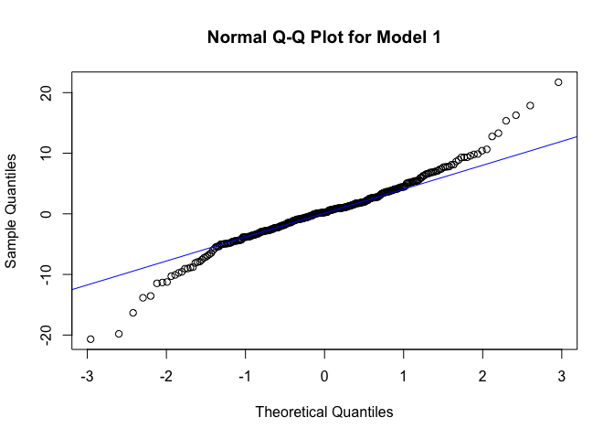

which aligns quite well on a straight line.

We see that from the above plots, **there is no trend, and no visible
change of variance, and no seasonality, and the sample mean = 0.25 is
almost zero. The histogram and the QQ plot looks okay.**

Now, we will plot out ACF and PACF of the residuals

``` r
acf(model1_res, lag.max=40)
```

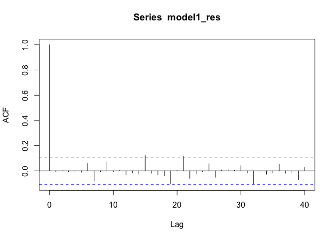

``` r
pacf(model1_res, lag.max=40)
```


All acf and pacf of residuals **are within confidence intervals**
(except acf at lag 15 and 21 but they are negiglible) and can be counted
as zeros.

Now we will check if this model can pass the tests.

##### Shapiro-Wilk Normality Test

``` r
shapiro.test(model1_res)
```

    ## 
    ##  Shapiro-Wilk normality test
    ## 
    ## data:  model1_res
    ## W = 0.9643, p-value = 4.028e-07

Since the p-value is within the significant level, the model fails the
shapiro wilk normality test.

##### Box-Pierce test

With degree of freedom 12 − (5+2) = 7,

``` r
Box.test(model1_res, lag = 12, type = c("Box-Pierce"), fitdf = 7)
```

    ## 
    ##  Box-Pierce test
    ## 
    ## data:  model1_res
    ## X-squared = 5.4354, df = 5, p-value = 0.3651

We see that the model passes the Box-Pierce test, p-value is larger than
significant level

##### Box-Ljung test

``` r
Box.test(model1_res, lag = 12, type = c("Ljung-Box"), fitdf = 7)
```

    ## 
    ##  Box-Ljung test
    ## 
    ## data:  model1_res
    ## X-squared = 5.6024, df = 5, p-value = 0.3468

We see that the model passes the Box-Ljung test, p-value is larger than
significant level.

##### Mc-Leod Li test

``` r
Box.test((model1_res)^2, lag = 12, type = c("Ljung-Box"), fitdf = 0)
```

    ## 
    ##  Box-Ljung test
    ## 
    ## data:  (model1_res)^2
    ## X-squared = 45.324, df = 12, p-value = 9.069e-06

the model fails the mc-leod Li test.

##### Yule-Walker (or MLE) estimation

``` r
ar(model1_res, aic = TRUE, order.max = NULL, method = c("yule-walker"))
```

    ## 
    ## Call:
    ## ar(x = model1_res, aic = TRUE, order.max = NULL, method = c("yule-walker"))
    ## 
    ## 
    ## Order selected 0  sigma^2 estimated as  26.95

Fitted residuals to AR(0), i.e. WN.

So the model passes all the test but **mc-leod Li** and **Shapiro-Wilk
Normality Test**

#### Diagonstics for model 2

The equation for the second model is

(1−*ϕ*<sub>1</sub>*B*−*ϕ*<sub>2</sub>*B*<sup>2</sup>)(1−*Φ*<sub>12</sub>*B*<sup>12</sup>)(1−*L*)(1−*B*<sup>12</sup>)*y*<sub>*t*</sub> = (1+*θ*<sub>1</sub>*B*+*θ*<sub>2</sub>*B*<sup>2</sup>)*Z*<sub>*t*</sub>

substituting the parameters, we have

(1−0.5338*B*−0.3358*B*<sup>2</sup>)(1+0.5004*B*<sup>12</sup>)(1−*L*)(1−*B*<sup>12</sup>)*y*<sub>*t*</sub> = (1−0.5788*B*−0.1315*B*<sup>2</sup>)*Z*<sub>*t*</sub>

##### Stationarity

``` r
plot.roots(NULL,polyroot(c(1, -0.5338, -0.3358)), main="Model 1, roots of AR part, nonseasonal ")
```


Clearly, all AR roots are outside of unit circle, but we also have
\|*Φ*<sub>1</sub>\| \< 1 so the model is stationary.

##### Invertibility

``` r
plot.roots(NULL,polyroot(c(1, -0.5788,-0.1315)), main="Model 1, roots of MA part, nonseasonal ")
```

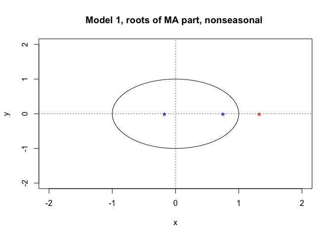

Clearly, all MA roots are outside of unit circle, so the model is
invertible.

##### Analyzing the residuals

We first look at the histogram of the residuals

``` r
model2_res <- residuals(model2)
hist(model2_res,density=20,breaks=20, col="blue", xlab="Histogram of residuals", prob=TRUE)
m1 <- mean(model2_res)
std1 <- sqrt(var(model2_res))
curve(dnorm(x,m1,std1), add=TRUE )
```


Which looks pretty normal, despite a larger peak at the center. Next we
will plot out the residuals

``` r
mean(model2_res)
```

    ## [1] 0.1359044

``` r
plot.ts(model2_res)
fit_res_1 <- lm(model2_res ~ as.numeric(1:length(model2_res))) 
abline(fit_res_1, col="red")
abline(h=mean(model2_res), col="blue")
```

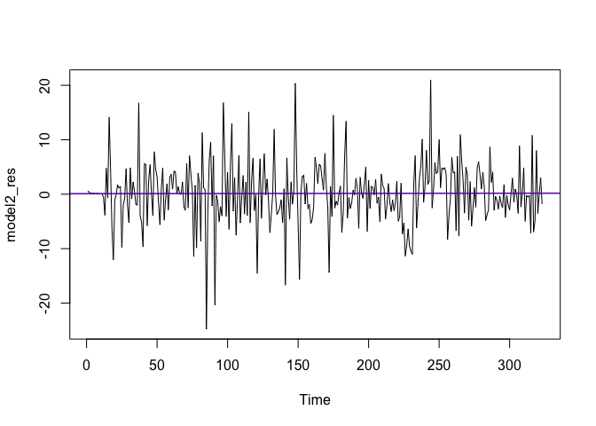

The mean is just 0.135 which is very close to 0.

Now we plot out a QQ Plot for the residuals

``` r
qqnorm(model2_res,main= "Normal Q-Q Plot for Model 1")
qqline(model2_res,col="blue")
```


which aligns quite well on a straight line.

We see that from the above plots, **there is no trend, and no visible
change of variance, and no seasonality, and the sample mean = 0.13 is
almost zero. The histogram and the QQ plot looks okay.**

Now, we will plot out ACF and PACF of the residuals

``` r
acf(model2_res, lag.max=40)
```

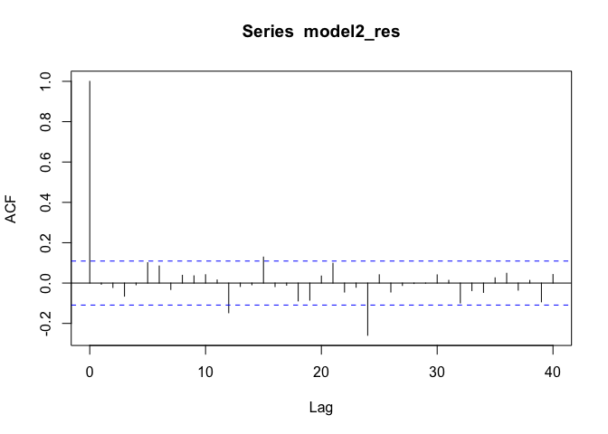

``` r
pacf(model2_res, lag.max=40)
```


All acf and pacf of residuals **are within confidence intervals**
(except at lag 12 and 24), this means that there is seasonality in the
residuals.

Now we will check if this model can pass the tests.

##### Shapiro-Wilk Normality Test

``` r
shapiro.test(model2_res)
```

    ## 
    ##  Shapiro-Wilk normality test
    ## 
    ## data:  model2_res
    ## W = 0.9668, p-value = 9.534e-07

Since the p-value is within the significant level, the model fails the
shapiro wilk normality test.

##### Box-Pierce test

With degree of freedom 12 − (5+2) = 7,

``` r
Box.test(model2_res, lag = 12, type = c("Box-Pierce"), fitdf = 4)
```

    ## 
    ##  Box-Pierce test
    ## 
    ## data:  model2_res
    ## X-squared = 16.06, df = 8, p-value = 0.04152

We see that the model fails the Box-Pierce test

##### Box-Ljung test

``` r
Box.test(model2_res, lag = 12, type = c("Ljung-Box"), fitdf = 4)
```

    ## 
    ##  Box-Ljung test
    ## 
    ## data:  model2_res
    ## X-squared = 16.595, df = 8, p-value = 0.03461

We see that the model fails the Box-Ljung test.

##### Mc-Leod Li test

``` r
Box.test((model2_res)^2, lag = 12, type = c("Ljung-Box"), fitdf = 0)
```

    ## 
    ##  Box-Ljung test
    ## 
    ## data:  (model2_res)^2
    ## X-squared = 69.624, df = 12, p-value = 3.766e-10

the model fails the mc-leod Li test.

##### Yule-Walker (or MLE) estimation

``` r
ar(model2_res, aic = TRUE, order.max = NULL, method = c("yule-walker"))
```

    ## 
    ## Call:
    ## ar(x = model2_res, aic = TRUE, order.max = NULL, method = c("yule-walker"))
    ## 
    ## Coefficients:
    ##       1        2        3        4        5        6        7        8  
    ## -0.0179  -0.0146  -0.0153   0.0003   0.0676   0.0636  -0.0170   0.0557  
    ##       9       10       11       12       13       14       15       16  
    ##  0.0711   0.0177   0.0014  -0.1784  -0.0092  -0.0107   0.1019  -0.0223  
    ##      17       18       19       20       21       22       23       24  
    ##  0.0121  -0.0302  -0.0697   0.0228   0.0789  -0.0331  -0.0177  -0.2693  
    ## 
    ## Order selected 24  sigma^2 estimated as  30.04

Did not fitted residuals to AR(0), i.e. WN.

So the model 2 **fails all the tests**

#### Conclusion for diagnostics

We have model 1 passes all the test but **Mc-leod Li** and
**Shapiro-Wilk Normality Test**. And model 2 fails all the tests. Notice
that

    Besides model 1, and model 2, I have ran the diagnostics with all top 10 models with lowest AICc values and none of them passes the Mc-Leod Li test and the Shapiro-Wilk Normality Test. This may due to the fact that there is a sequence of anomaly datapoint between 2008 and 2009, causing deviation in fitting the model, and therefore failing the Mc-leod Li and Shapiro-Wilk Normality Test.

Therefore, I will choose model 1 as my final model, since it has a
lowest AICc value, and passes most of the tests.

$$
\\operatorname{SARIMA}(5,1,2)\\times(0,1,1)\_{12}\\\\
$$

as our final model, where

(1−0.8938*B*+0.0710*B*<sup>2</sup>+0.0136*B*<sup>3</sup>−0.0108*B*<sup>4</sup>−0.0732*B*<sup>5</sup>)(1+0.7474*B*<sup>12</sup>)(1−*B*)(1−*B*<sup>12</sup>)*y*<sub>*t*</sub> = (1−0.9494*B*+0.2416*B*<sup>2</sup>)*Z*<sub>*t*</sub>

### Forcasting with final model

Now we will try to forecast two year (24 datapoints) using our final
model, we use red circles to denote the forecast values and blue dashed
lines as our confidence interval

``` r
library(forecast)
```

    ## Registered S3 method overwritten by 'quantmod':
    ##   method            from
    ##   as.zoo.data.frame zoo

    ## Registered S3 methods overwritten by 'forecast':
    ##   method                 from     
    ##   autoplot.Arima         ggfortify
    ##   autoplot.acf           ggfortify
    ##   autoplot.ar            ggfortify
    ##   autoplot.bats          ggfortify
    ##   autoplot.decomposed.ts ggfortify
    ##   autoplot.ets           ggfortify
    ##   autoplot.forecast      ggfortify
    ##   autoplot.stl           ggfortify
    ##   autoplot.ts            ggfortify
    ##   fitted.ar              ggfortify
    ##   fortify.ts             ggfortify
    ##   residuals.ar           ggfortify

``` r
pred.tr <- predict(model1, n.ahead = 24)
U.tr= pred.tr$pred + 2*pred.tr$se
L.tr= pred.tr$pred - 2*pred.tr$se
ts.plot(employees.training, xlim=c(1,length(employees.training)+12), ylim = c(min(employees.training),max(U.tr)))
lines(U.tr, col="blue", lty="dashed")
lines(L.tr, col="blue", lty="dashed")
points((length(employees.training)+1):(length(employees.training)+24), pred.tr$pred, col="red")
```

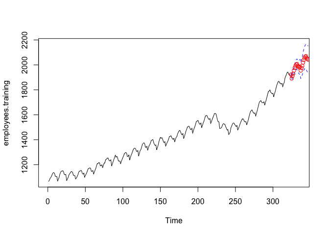

Which looks pretty good, we can further verify if our testing data is
within the confidence interval with a zoomed view.

``` r
ts.plot(employees, xlim = c(240,length(employees.training)+24), ylim = c(1400,max(U.tr)), col="red")
lines(U.tr, col="blue", lty="dashed")
lines(L.tr, col="blue", lty="dashed")
points((length(employees.training)+1):(length(employees.training)+24),  pred.tr$pred , col="black")
```

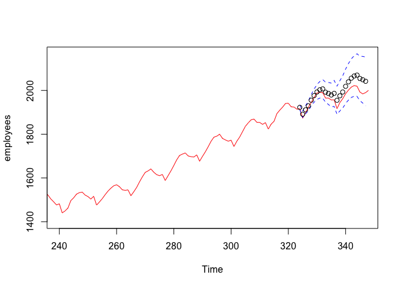

As we can see, the forecast values are now black circles, and the red
line is the true values. We see that **the test set is within the
confidence interval**. Even though that the model constantly
**overestimated** the values in the forecast.

### Spectral Analysis

#### Periodogram of training data

Drawing a periodogram may tell the period of the original data.

``` r
require(TSA)
```

    ## Loading required package: TSA

    ## Registered S3 methods overwritten by 'TSA':
    ##   method       from    
    ##   fitted.Arima forecast
    ##   plot.Arima   forecast

    ## 
    ## Attaching package: 'TSA'

    ## The following objects are masked from 'package:stats':
    ## 
    ##     acf, arima

    ## The following object is masked from 'package:utils':
    ## 
    ##     tar

``` r
periodogram(employees)
abline(h=0)
axis(1,at=c(0.0033,0.084))
```

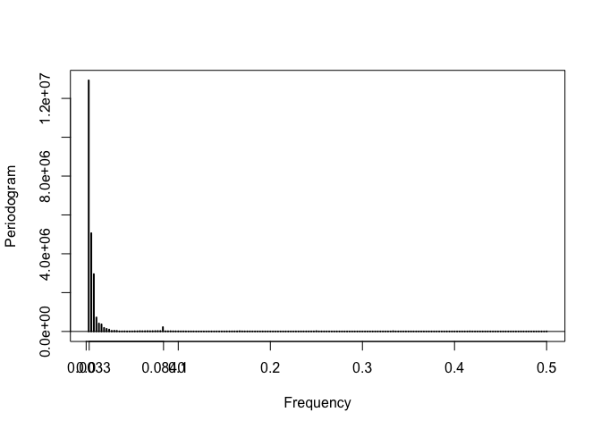

And we observe from the periodogram that there is a spike at
0.084 ≈ 1/12, indicating a period of 12 month (1 year). Another spike
occur at 0.0033 ≈ 303 months, which is 25.25 years. This confirms that
we should difference at at period of 12.

#### Periodogram of residuals

We may also plot out the periodogram of residuals.

``` r
periodogram(model1_res)
abline(h=0)
```

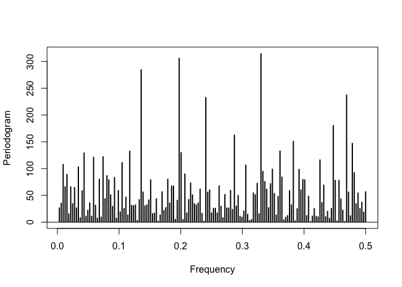

We see that there is no predominant frequencies

#### Fisher’s Test

Fisher’s test enables one to test the data for the presence of hidden
periodicities with unspecified frequency

``` r
library(GeneCycle)
```

    ## Loading required package: longitudinal

    ## Loading required package: corpcor

    ## Loading required package: fdrtool

    ## 
    ## Attaching package: 'GeneCycle'

    ## The following object is masked from 'package:TSA':
    ## 
    ##     periodogram

    ## The following object is masked from 'package:forecast':
    ## 
    ##     is.constant

``` r
fisher.g.test(model1_res)
```

    ## [1] 0.445354

So the model passes the Fisher’s Test, and we may conclude that there is
no hidden periodicities with unspecified frequency

#### Kolmogorov-Smirnov test for cumulative periodogram

We apply the Kolmogorov-Smirnov test to residuals to assess whether
residuals are Gaussian white noise

``` r
cpgram(model1_res,main="Kolmogorov-Smirnov test")
```

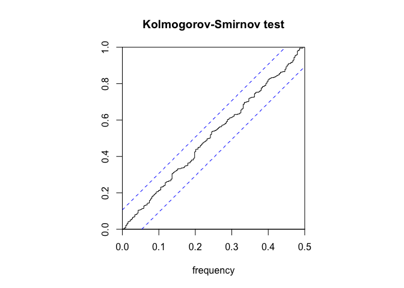

And clearly it passes the kolmogorov-Smirnov test, so the residuals are
Gaussian white noise.

## Conclusion

In this forecasting assignment, we selected a
SARIMA (5,1,2) × (0,1,1)<sub>12</sub> model to forecast the number of
employees in the Hospitality Industry. By comparing the forecasting
values with the actual values, we found that the model overestimated the
number of employees, with increasing gaps as time progreeses.

### What to do next?

We see that there is some inaccuracy in forecasting. We can improve the
forecasting accuracy by training the model **using only the data after
2010**, the reason for doing this is

-   There was a sequence of anomaly data between 2008 and 2009, which
    brings bias to the model.
-   The time series data looks fairly consistent after 2010

### Math Formulas Used

#### Confidence interval

An approximate confidence interval for *μ*<sub>*X*</sub> is

$$
\\left(\\bar{X}\_n-1.96 v^{1 / 2} / \\sqrt{n}, \\bar{X}\_n+1.96 v^{1 / 2} / \\sqrt{n}\\right)
$$

#### Residuals

$$
\\hat{W}\_t \\equiv \\hat{W}\_t(\\underline{\\hat{\\phi}}, \\underline{\\hat{\\theta}})=\\left(X_t-\\hat{X}\_t(\\underline{\\hat{\\phi}}, \\underline{\\hat{\\theta}})\\right) /\\left(r\_{t-1}(\\underline{\\hat{\\phi}}, \\underline{\\hat{\\theta}})\\right)^{1 / 2}, t=1, \\ldots, n,
$$

where $(\\underline{\\hat{\\phi}}, \\underline{\\hat{\\theta}})$ are
MLEs of $(\\underline{\\phi}, \\underline{\\theta})$ and
$\\hat{X}\_t(\\underline{\\hat{\\phi}}, \\underline{\\hat{\\theta}}) \\equiv \\hat{X}\_t$
is the one-step ahead prediction of *X*<sub>*t*</sub> based on the
chosen model.

#### Ljung Box Test

$$
\\tilde{Q}\_W=n(n+2) \\sum\_{j=1}^h \\hat{\\rho}\_{\\hat{W}}^2(j) /(n-j) \\sim \\chi^2(h-p-q),
$$

#### McLeod Li Test

$$
\\hat{\\rho}\_{\\hat{W} \\hat{W}}(h)=\\sum\_{t=1}^{n-h}\\left(\\hat{W}\_t^2-\\bar{W}^2\\right)\\left(\\hat{W}\_{t+h}^2-\\bar{W}^2\\right) / \\sum\_{t=1}^n\\left(\\hat{W}\_t^2-\\bar{W}^2\\right)^2, \\quad h=1,2, \\ldots
$$

where $\\bar{W}^2=(1 / n) \\sum\_{t=1}^n \\hat{W}\_t^2$.

## References

1.  What Is the Hospitality Industry? Your Complete Guide
    <https://www.cvent.com/en/blog/hospitality/what-is-the-hospitality-industry>

2.  Hospitality Employees Time Series
    Dataset<https://www.kaggle.com/datasets/gabrielsantello/hospitality-employees-time-series-dataset/code>

3.  Class Notes and Powerpoints

## Appendix

``` r
setwd("/Users/teo/Desktop/pstat-174-final-project")
set.seed(1205)
hos <- read.csv("data/HospitalityEmployees.csv")
employees <- hos$Employees
nt <- length(employees)
tsdat <- ts(employees, start = c(1990,1), end = c(2018,12), frequency = 12)
ts.plot(tsdat, main = "Raw Data")
abline(h=mean(employees), col="blue")
employees.training <- employees[c(1:323)]
employees.test <- employees[c(324:348)]
plot.ts(employees.training)
fit <- lm(employees.training ~ as.numeric(1:length(employees.training)))
abline(fit, col="red")
abline(h=mean(employees), col="blue")
hist(employees.training, col="light blue", xlab="", main="histogram; employee data")
acf(employees.training,lag.max=40, main="ACF of the Airpass Data")
library(ggplot2)
library(ggfortify)
y <- ts(employees.training, frequency = 12)
decomp <- decompose(y)
plot(decomp)
var(employees.training)[1]
employees_lag12 <- diff(employees.training,lag = 12)
plot.ts(employees_lag12, main="U_t differenced at lag 12")
fit <- lm(employees_lag12 ~ as.numeric(1:length(employees_lag12)))
abline(fit, col="red")
abline(h=mean(employees_lag12), col="blue")
var(employees_lag12)
acf(employees_lag12, lag.max=40, main="ACF of the U_t, differenced at lag 12")
employees_stat <- diff(employees_lag12,lag = 1)
plot.ts(employees_stat, main="U_t differenced at lag 12 & lag 1")
fit <- lm(employees_stat ~ as.numeric(1:length(employees_stat)))
abline(fit, col="red")
abline(h=mean(employees_stat), col="blue")
var(employees_stat)
hist(employees_stat, density=20,breaks=20, col="blue", xlab="", prob=TRUE)
m<-mean(employees_stat)
std<- sqrt(var(employees_stat))
curve( dnorm(x,m,std), add=TRUE )
acf(employees_stat, lag.max=40, main="ACF of the U_t, differenced at lags 12 and 1")
pacf(employees_stat, lag.max=40, main="PACF of the U_t, differenced at lags 12 and 1")
library(qpcR)
print("p d q P D Q")
for (p in c(0,2,5)){
    for (d in c(1)){
        for (q in c(0,2,5)){
            for (P in c(0,1)){
                for (D in c(1)){
                    for (Q in c(0,1)){
                        print(c(p,d,q,P,D,Q))
                        print(AICc(arima(employees.training,order = c(p,d,q),seasonal = list(order = c(P,D,Q), period = 12), method="ML"))) 
                    }
                }
            }
        }
    }
}
model1 <- arima(employees.training,order = c(5,1,2),seasonal = list(order = c(0,1,1), period = 12), method="ML")
model1
AICc(model1)
AICc(arima(employees.training,order = c(5,1,2),seasonal = list(order = c(0,1,1), period = 12), method="ML",fixed= c(NA,0,0,0,0,NA,0,NA)))
model2 <- arima(employees.training,order = c(2,1,2),seasonal = list(order = c(1,1,0), period = 12), method="ML")
model2
AICc(model2)
AICc(arima(employees.training,order = c(2,1,2),seasonal = list(order = c(1,1,0), period = 12),fixed = c(NA,NA,0,0,NA), method="ML"))
source("plot.roots.R")
plot.roots(NULL,polyroot(c(1, -0.8398, 0.0710, 0.0136,-0.0108,-0.0732)), main="Model 1, roots of AR part, nonseasonal ")
plot.roots(NULL,polyroot(c(1, -0.9494,0.2416)), main="Model 1, roots of ma part, nonseasonal ")
model1_res <- residuals(model1)
hist(model1_res,density=20,breaks=20, col="blue", xlab="Histogram of residuals", prob=TRUE)
m1 <- mean(model1_res)
std1 <- sqrt(var(model1_res))
curve(dnorm(x,m1,std1), add=TRUE )
mean(model1_res)
plot.ts(model1_res)
fit_res_1 <- lm(model1_res ~ as.numeric(1:length(model1_res))) 
abline(fit_res_1, col="red")
abline(h=mean(model1_res), col="blue")
qqnorm(model1_res,main= "Normal Q-Q Plot for Model 1")
qqline(model1_res,col="blue")
acf(model1_res, lag.max=40)
pacf(model1_res, lag.max=40)
shapiro.test(model1_res)
Box.test(model1_res, lag = 12, type = c("Box-Pierce"), fitdf = 7)
Box.test(model1_res, lag = 12, type = c("Ljung-Box"), fitdf = 7)
Box.test((model1_res)^2, lag = 12, type = c("Ljung-Box"), fitdf = 0)
ar(model1_res, aic = TRUE, order.max = NULL, method = c("yule-walker"))
plot.roots(NULL,polyroot(c(1, -0.5338, -0.3358)), main="Model 1, roots of AR part, nonseasonal ")
plot.roots(NULL,polyroot(c(1, -0.5788,-0.1315)), main="Model 1, roots of MA part, nonseasonal ")
model2_res <- residuals(model2)
hist(model2_res,density=20,breaks=20, col="blue", xlab="Histogram of residuals", prob=TRUE)
m1 <- mean(model2_res)
std1 <- sqrt(var(model2_res))
curve(dnorm(x,m1,std1), add=TRUE )
mean(model2_res)
plot.ts(model2_res)
fit_res_1 <- lm(model2_res ~ as.numeric(1:length(model2_res))) 
abline(fit_res_1, col="red")
abline(h=mean(model2_res), col="blue")
qqnorm(model2_res,main= "Normal Q-Q Plot for Model 1")
qqline(model2_res,col="blue")
acf(model2_res, lag.max=40)
pacf(model2_res, lag.max=40)
shapiro.test(model2_res)
Box.test(model2_res, lag = 12, type = c("Box-Pierce"), fitdf = 4)
Box.test(model2_res, lag = 12, type = c("Ljung-Box"), fitdf = 4)
Box.test((model2_res)^2, lag = 12, type = c("Ljung-Box"), fitdf = 0)
ar(model2_res, aic = TRUE, order.max = NULL, method = c("yule-walker"))
library(forecast)
pred.tr <- predict(model1, n.ahead = 24)
U.tr= pred.tr$pred + 2*pred.tr$se
L.tr= pred.tr$pred - 2*pred.tr$se
ts.plot(employees.training, xlim=c(1,length(employees.training)+12), ylim = c(min(employees.training),max(U.tr)))
lines(U.tr, col="blue", lty="dashed")
lines(L.tr, col="blue", lty="dashed")
points((length(employees.training)+1):(length(employees.training)+24), pred.tr$pred, col="red")
ts.plot(employees, xlim = c(240,length(employees.training)+24), ylim = c(1400,max(U.tr)), col="red")
lines(U.tr, col="blue", lty="dashed")
lines(L.tr, col="blue", lty="dashed")
points((length(employees.training)+1):(length(employees.training)+24),  pred.tr$pred , col="black")
require(TSA)
periodogram(employees)
abline(h=0)
axis(1,at=c(0.0033,0.084))
periodogram(model1_res)
abline(h=0)
library(GeneCycle)
fisher.g.test(model1_res)
cpgram(model1_res,main="Kolmogorov-Smirnov test")
```
